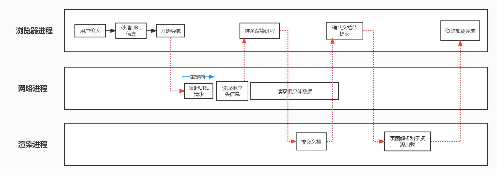
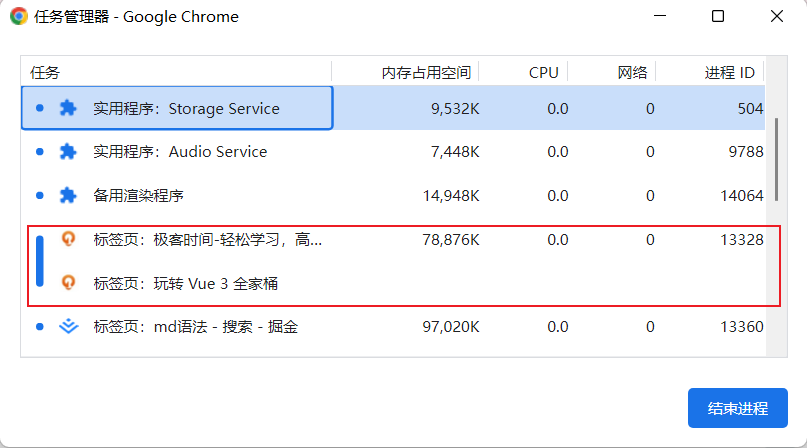
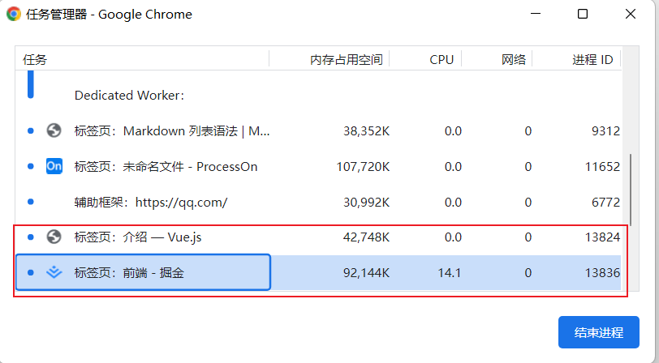
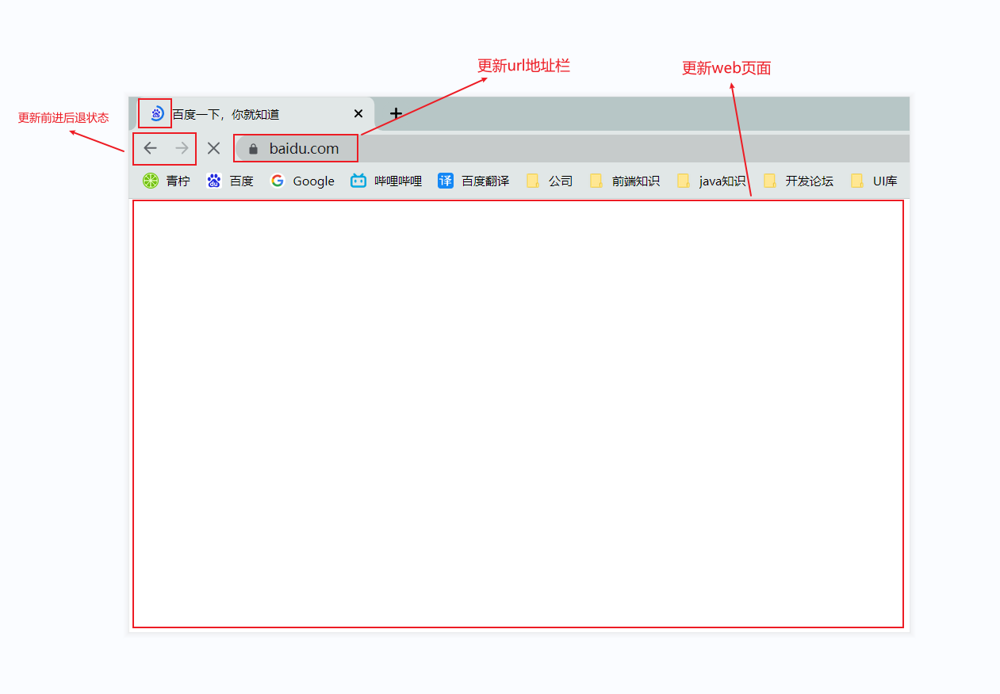

“在浏览器里，从输入URL到页面展示的过程中都发生了什么？”


今天一起来探索一下这个流程，下图是“从输入URL到页面展示流程的示意图”





从图中可以看出，**整个流程需要多个进程之间的配合**，在开始前，先回顾一下浏览器进程，网络进程，渲染进程的主要职责。


* 浏览器进程主要负责子进程管理，用户交互，文件下载等与浏览器系统有关的功能。
* 网络进程主要负责向浏览器进程和渲染进程提供网络下载功能。
* 渲染进程主要职责是将网络下载的html，js，css，图片等资源文件解析为可被用户所看到和交互的页面。


我们结合上图来看下下面这个完整的流程，整体流程包含了许多步骤，大致流程描述如下：


* 首先，浏览器进程接收用户输入的URL请求，浏览器进程便将URL转发给网络进程。
* 在网络进程中发起真正的URL请求。
* 在网络进程中接收到响应头数据，开始解析响应头数据，并将相应头数据转发给浏览器进程。
* 浏览器进程接收到网络进程转发的响应头数据后，发送 “提交导航(CommitNavigation)” 消息到渲染进程。
* 渲染进程接受到 “提交导航” 的消息后，便开始准备接受 html 数据，接受数据的方式为和网络进程之间建立 IPC 数据通道。
* 最后渲染进程会向浏览器进程 “确认提交”，这是告诉浏览器进程：已经接收好响应体数据和准备开始解析页面数据了。
* 浏览器进程接收到 “提交文档” 的消息之后，便开始移除之前的旧文档，然后更新浏览器进程中的页面状态。

这其中，**用户发出URL请求到页面开始解析的过程，就叫做导航**


### 从输入URL到页面展示

现在知道了浏览器主要进程的职责，还有在导航阶段经历的几个主要阶段，下面来详细分析下这几个阶段


#### 1、用户输入

当用户在地址栏输入一个查询关键字时，地址栏会判断当前输入的是**搜索内容**，还是**URL**。

* 如果是搜索内容，地址栏会使用浏览器默认的搜索引擎，来合成新的带搜索关键字的URL。
* 如果判断为URL，比如输入的是 www.baidu.com，那么地址栏根据规则，把这段内容加上协议，合成为完整的URL，如 https://www.baidu.com。

当用户输入关键字并回车时，意味着当前页面即将要被替换成新的页面，不过在这个流程继续之前，浏览器还给了当前页面一次执行 beforeunload 事件的机会，beforeunload 事件允许页面在退出之前执行一些数据清理操作，还可以查询用户是否确认要离开当前页面。因此用户可以通过 beforeunload 事件来取消导航，让浏览器不在执行任何后续工作。


当前页面没有监听 beforeunload 事件或者同意继续后面流程，那么浏览器便进入下图状态：


从图中可以看出，当浏览器刚开始加载一个地址之后，标签页上的图标就进入了加载状态。但此时图中页面显示的依然是之前打开的页面内容，并没有立即被替换。因为需要等待提交文档阶段，页面内容才会被替换。


#### 2、URL请求过程

接下来就到了页面资源请求过程。这时，浏览器进程会通过进程间通信(IPC)将URL请求转发至网络进程，网络进程接收到URL请求后，发起真正的URL请求。


首先，网络进程会在本地缓存中查找是否有该资源缓存。如果有资源缓存，那么直接返回资源给浏览器进程；如果没有缓存资源，那么进入网络请求阶段。请求的第一步是 DNS 解析，以获取请求域名的服务器IP地址。如果请求协议是 https ，还需要建立 TLS 连接。


接下来是利用IP地址和服务器建立TCP连接。连接建立后，浏览器端会构建请求行，请求头等信息，并把和该域名相关的cookie等数据附加到请求头之中，然后向服务器发送请求。


服务器接收到请求后，会根据请求信息生成对应的响应数据(包括响应行，响应头和响应体等数据)，并发送给网络进程。等网络进程接收的响应行和响应头之后，就开始解析响应头内容。


##### (1) 重定向

在接收到服务器返回的响应头后，网络进程开始解析响应头，如果发现返回的状态码是 301 或者 302，那么说明服务器需要浏览器重定向到其他 URL。这时网络进程会从响应头的 Location 字段里面读取重定向的地址，然后再发起新的 HTTP 或者 HTTPS 请求，一切又重头开始了。


**在导航过程中，如果服务器响应行的状态码包含了 301、302 一类的跳转信息，浏览器会跳转到新的地址继续导航；如果响应行是 200，那么表示浏览器可以继续处理该请求。**


##### (2) 响应数据类型处理

在处理了跳转信息之后，我们继续导航流程的分析。URL 请求的数据类型，有时候是一个下载类型，有时候是正常的 HTML 页面，那么浏览器是如何区分它们呢？

答案是 Content-Type。**Content-Type 是 HTTP 头中一个非常重要的字段， 它告诉浏览器服务器返回的响应体数据是什么类型**，然后浏览器会根据 Content-Type 的值来决定如何显示响应体的内容。


需要注意的是，如果服务器配置 Content-Type 不正确，比如将 text/html 类型配置成 application/octet-stream 类型，那么浏览器可能会曲解文件内容，比如会将一个本来是用来展示的页面，变成了一个下载文件。


所以，不同 Content-Type 的后续处理流程也截然不同。如果 Content-Type 字段的值被浏览器判断为**下载类型，那么该请求会被提交给浏览器的下载管理器，同时该 URL 请求的导航流程就此结束**。但如果是**HTML，那么浏览器则会继续进行导航流程**。由于 Chrome 的页面渲染是运行在渲染进程中的，所以接下来就需要准备渲染进程了。


#### 3、准备渲染进程

默认情况下，浏览器会为每个页面分配一个渲染进程，也就是说，没打开一个新tab页签，就会创建一个新的渲染进程。但是也有例外，在某些情况下，不会新创建渲染进程。如下图所示：




从图中可以看出，打开的两个页面只有一个渲染进程，进程id为 13328。


**那么什么情况下会出现只有一个渲染进程的情况呢？**


要解决这个问题，需要先了解一下什么是同一站点 (same-site)。具体来说，我们将 “**同意站点**” 定义为**根域名**（比如baidu.com）加上**协议**（比如https）,包含了该根域名下所有子域名和不同的端口，如下所示：

```js
https://www.baidu.com
https://fanyi.baidu.com
https://fanyi.baidu.com:8080
```

它们都属于同一站点，因为它们的根域名 (baidu.com) 和协议 (https) 都相同。


Chrome 的默认策略是，每个标签对应一个渲染进程。但**如果从一个页面打开了另一个新页面，而新页面和当前页面属于同一站点的话，那么新页面会复用父页面的渲染进程**。官方把这个默认策略叫 process-per-site-instance。


那若新页面和当前页面不属于同一站点，情况又会发生什么样的变化呢？比如我通过vue.js页面里的链接打开掘金的官网（https://juejin.cn/）， 因为 juejin.cn 和 vuejs.org 不属于同一站点，所以 juejin.cn 会使用一个新的渲染进程，你可以参考下图：





juejin.cn 的根域名不同于 vuejs.org，也就是说 vue 和掘金不属于同一站点，因此它们会运行在两个不同的渲染进程之中。


总结来说，打开一个新页面采用的**渲染进程策略**就是：

* 通常情况下，打开新的页面都会使用单独的渲染进程；
* 如果从 A 页面打开 B 页面，且 A 和 B 都属于**同一站点**的话，那么 B 页面复用 A 页面的渲染进程；如果是其他情况，浏览器进程则会为 B 创建一个新的渲染进程。


渲染进程准备好之后，还不能立即进入文档解析状态，因为此时的文档数据还在网络进程中，并没有提交给渲染进程，所以下一步就进入了提交文档阶段。


#### 4、提交文档

所谓提交文档，就是指浏览器进程将网络进程接收到的 HTML 数据提交给渲染进程，具体流程是这样的：

* 首先当浏览器进程接收到网络进程的响应头数据之后，便向渲染进程发起“提交导航”的消息；
* 渲染进程接收到“提交导航”的消息后，会和网络进程建立传输数据的“管道”；
* 等文档数据传输完成之后，渲染进程会返回“确认提交”的消息给浏览器进程；
* 浏览器进程在收到“确认提交”的消息后，会更新浏览器界面状态，包括了安全状态、地址栏的 URL、前进后退的历史状态，并更新 Web 页面。


其中，当渲染进程**确认提交**之后，更新内容如下图所示：





这也就解释了为什么在浏览器的地址栏里面输入了一个地址后，之前的页面没有立马消失，而是要加载一会儿才会更新页面。


#### 5、渲染阶段

一旦文档被提交，渲染进程便开始页面解析和子资源加载了，关于这个阶段的完整过程，会在下一篇文章中来专门介绍。这里你只需要先了解一旦页面生成完成，渲染进程会发送一个消息给浏览器进程，浏览器接收到消息后，会停止标签图标上的加载动画。


至此，一个完整的页面就生成了。那文章开头的“从输入 URL 到页面展示，这中间发生了什么？”这个过程及其“串联”的问题也就解决了。


#### 总结

* 从输入URL到展示的过程中，需要经过多个进程协同合作。
* 服务器可以通过响应头来控制浏览器的行为，如页面跳转，文件下载。
* Chrome默认每个tab页标签会新建一个渲染进程，但是同一站点下的页面只通过同一个渲染线程渲染。
* 浏览器的导航过程涵盖了从用户发起请求到提交文档给渲染进程的中间所有阶段。


导航流程很重要，它是网络加载流程和渲染流程之间的一座桥梁，如果你理解了导航流程，那么你就能完整串起来整个页面显示流程，这对于理解浏览器的工作原理起到了点睛的作用。